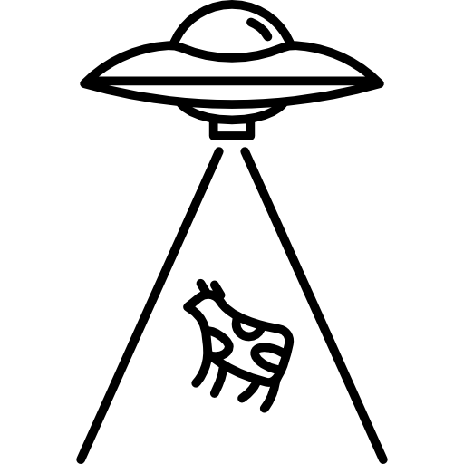
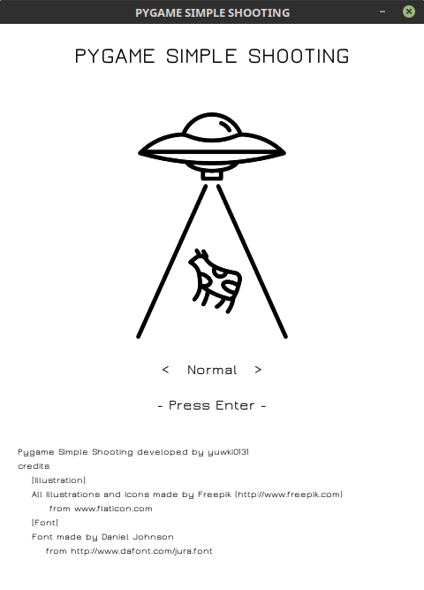
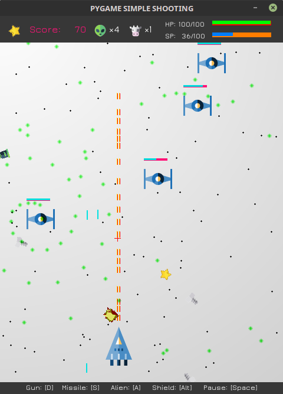
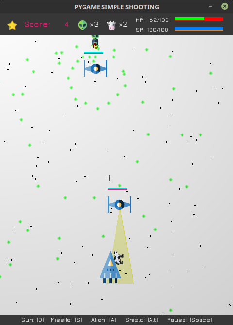
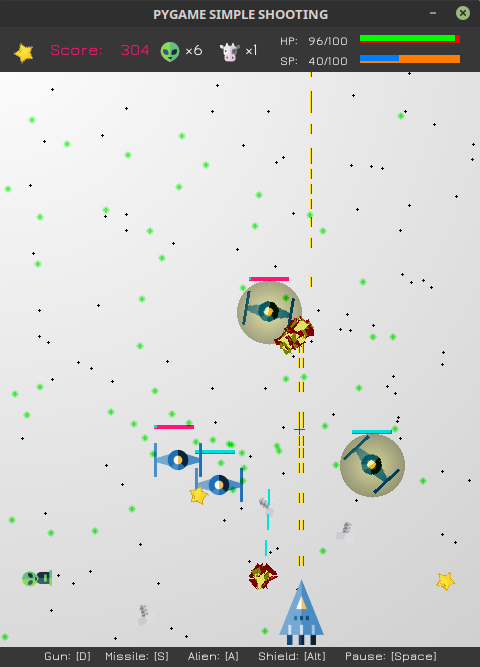

# PYGAME SIMPLE SHOOTING



## Description

 Simple Space Shooting Game (developed by Pygame)

## Screenshots





## Requirements

* Linux (operation unconfirmed : Windows & MacOS)
* Python3
* pygame (for python3)

## How to run

```
$ git clone https://github.com/yuwki0131/pygame-simple-shooting
$ pip install pygame # if you need
$ python pygame-simple-shooting/game/main.py
```

or

```
$ git clone https://github.com/yuwki0131/pygame-simple-shooting
$ pip3 install pygame # if you need
$ python3 pygame-simple-shooting/game/main.py
```

## Credits
* Illustration and All Icons made by Freepik (http://www.freepik.com) from www.flaticon.com
* Font made by Daniel Johnson from http://www.dafont.com/jura.font
